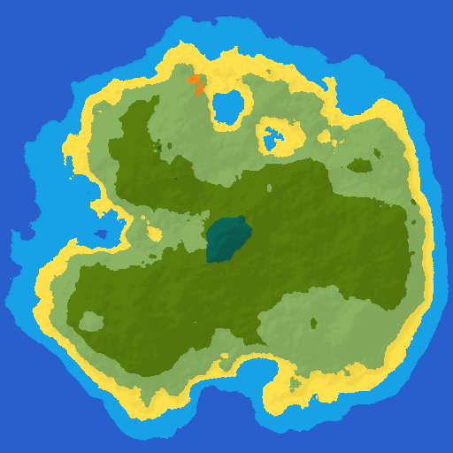

Yaban is a procedural island generator that based on two 2D noise map.  
One is for moisture, the other one is for height.

* [Github Repository](https://github.com/cevherkarakoc/Yaban "Github")
* [Demo](https://ceveka.com/Yaban/ "Demo")
